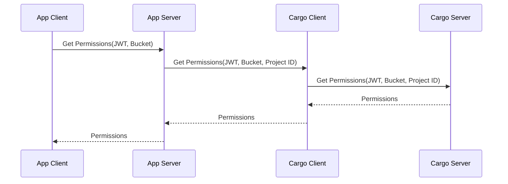
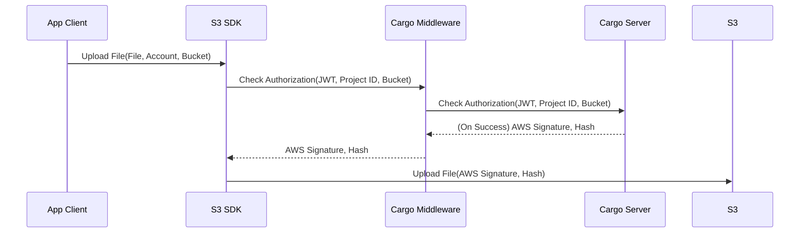
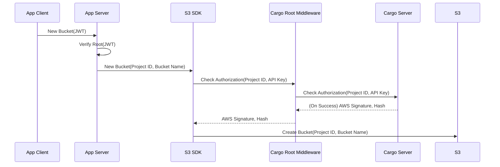

# SAIL Cargo Microservice

## Introduction to Cargo

Cargo is a microservice in SAIL which provides the ability to give users permission based access to S3 compatible object storage. Cargo stores read/write/delete/admin access for each user on each bucket. Cargo provides an interface for querying and manipulating user permissions as well as enforcing access through a provided S3 middleware.

## Architecture

Cargo is made up of three distinct components.

Cargo Server: Deployment which handles user permission storage and verifies a user's ability to interact with a specific resource based on the stored user permissions.

Cargo Client: Typescript library which allows for querying and manipulating permissions. Communicates with the Cargo Server. Intended to be used on an application backend. Applications are authenticated via API key.

Cargo Middleware: Typescript library which provides an S3 compliant middleware. The middleware communicates with the Cargo Server to generate the correct [AWS signature](https://docs.aws.amazon.com/AmazonS3/latest/API/sig-v4-authenticating-requests.html) if the user has the correct permissions. The user is identified via [JWT](https://jwt.io/).

### Sample Workflows

#### Getting User Permissions for a Specific Bucket

Below is a sample workflow involving an application client and server. In this case the application is getting the user permissions for a specific bucket. The project ID is the unique ID for this specific application.

The back and forth between between the application and Cargo allows for custom logic in terms of how to map different entities to buckets. For example, the application client may work in terms of "datasets" and the application server translates the "datasets" into different buckets.

#### Writing a File

Below is a sample where the user is uploading a file to the object storage. 

The Cargo Middleware, which is added to the S3 middleware stack, checks for authorization against the Cargo Server. The Cargo server in turn provides the correct AWS Signature and Hash if the user has the ability to write to the bucket. The S3 SDK itself is not configured with the credentials needed to access the S3 compatible endpoint, and relies on the Cargo Middleware and Cargo Server to produce the required signature and hash of the body.

#### Root Level Actions

Functionality such as creating and deleting buckets is expected to be handled on the App Server side using a special middleware which makes use of the API key granted to the App Server. Below is an example where the application specific root user logs in and requests a new bucket.

## Authentication and Authorization

### Authentication

Authentication of the user takes place via SAIL Auth Microservice provided JWTs. The Cargo Server will get the RSA public key from the Auth Microservice to authenticate the JWT provided from either the App Client or App Server.

### Authorization

Authorization will be handled by the Cargo Server which will store user permissions per user per bucket. Those permissions will be read, write, delete, and admin.

| Permission | Ability                                                 |
| ---------- | ------------------------------------------------------- |
| Read       | List the contents of a bucket and read (download) files |
| Write      | Write files into a bucket                               |
| Delete     | Remove files from a bucket                              |
| Admin      | Change permissions for users on this bucket             |

Note, for certain use cases various combinations may not make sense. For example, in one application someone who is an admin may need to have all permissions. This is where the App Server must constrain those application specific use cases.

### Root User

The root user is represented by the App Server itself and is accessed via the API key granted to the App Server. For functionality such as adding or removing buckets, the App Server accomplishes this through root access middleware which uses the API key to get the AWS signature and hash.

### AWS Signature and Hash

The technology which allows for these interacts to take place is the AWS Signature V4. The signing method involves a hash using the HTTP request for the operation and the secret key. Additionally a SHA256 hash of the request body needs to be provided. For more information on how these are generated, refer to the [AWS official documentation](https://docs.aws.amazon.com/AmazonS3/latest/API/sig-v4-authenticating-requests.html).

SAIL Cargo works by accepting the HTTP request as a parameter and using the AWS Signature V4 library to manually produce the signature and hash. In this way, the secret key for the S3 interface is contained to the Cargo Server and the appearance of having many different tokens with different access levels is possible.

