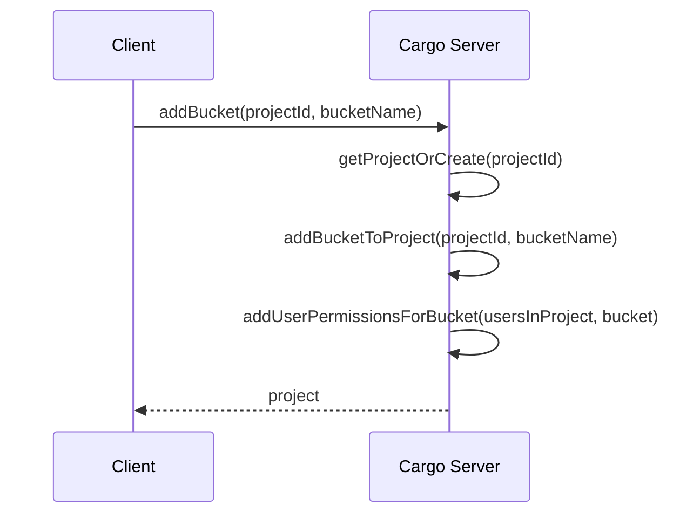
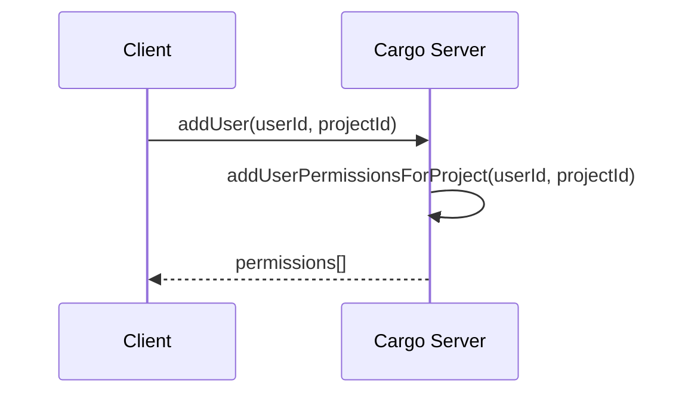
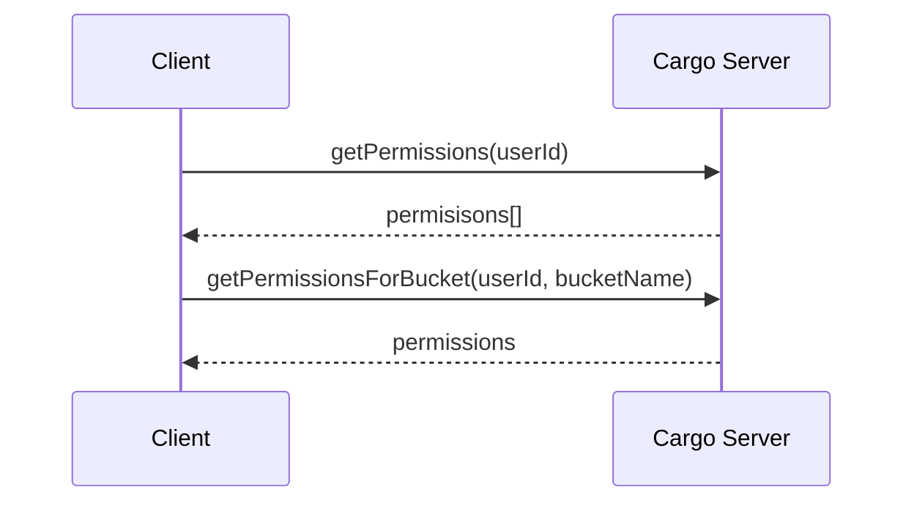
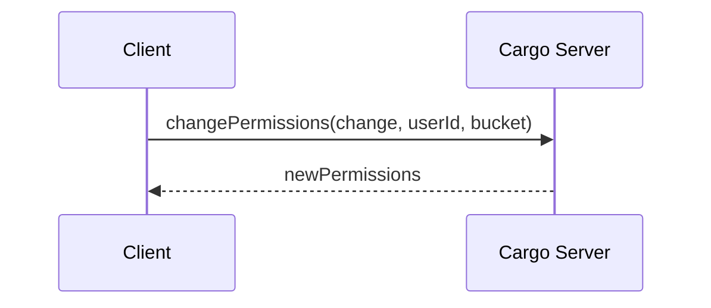

# Cargo Server

## Running the Project

### Configuration

For configurable settings, please see `src/config/configuration.ts` for the supported settings and their corresponding environment variable.

### Running in Development

1. Start an instance of MongoDB
2. Run the command `npm run start:dev`

## Example Procedures

The Cargo server supported interactions via GraphQL. Below are example workflows shown for a high level. For specifics on how to perform the actions show, refer to the GraphQL documentation. In the diagrams below, "Client" refers to the software interacting with the Cargo Server. This should typically be either the Cargo Middleware or Cargo Client.

:warning: Developer note, the function names shown in the diagrams are to illustrate the operations taking place. They are not the actual function names

### Adding a Bucket to the Server

The server maintains a list of supported projects and the buckets contained in that project. See `src/project/project.model.ts` for more information on what is stored. When a request is made to add a bucket to a project not yet stored in the system, an entry for that project will be added.

Something to note, the Cargo Server itself is not creating a new bucket. The Cargo Server merely maintains user permissions for a bucket and nothing more. The bucket itself can be created in the S3 instance either before or after updating the Cargo Server. Ideally the Cargo Server would be updated after to ensure the bucket is created successfully.

Additionally, when a new bucket is added, users in Cargo Server who are associated with the given project will automatically have User Permissions generated for them (with no actual access granted) so that you can immediately query user permissions for that new bucket.

### Adding a User to the Server

Adding a user will automatically populate user permissions for all buckets in the user's corresponding project. The user will be granted no actual access so the correct permissions will need to be added later. 

The client will get back the list of permissions that were generated for the user.

### Getting Permissions

The client can request permissions in a couple of different contexts. The client can either get the permissions for a single user on a single bucket, or they can get all user permissions for a given user.

### Updating Permissions

The client can update the permissions by providing the permissions for a user and bucket.

