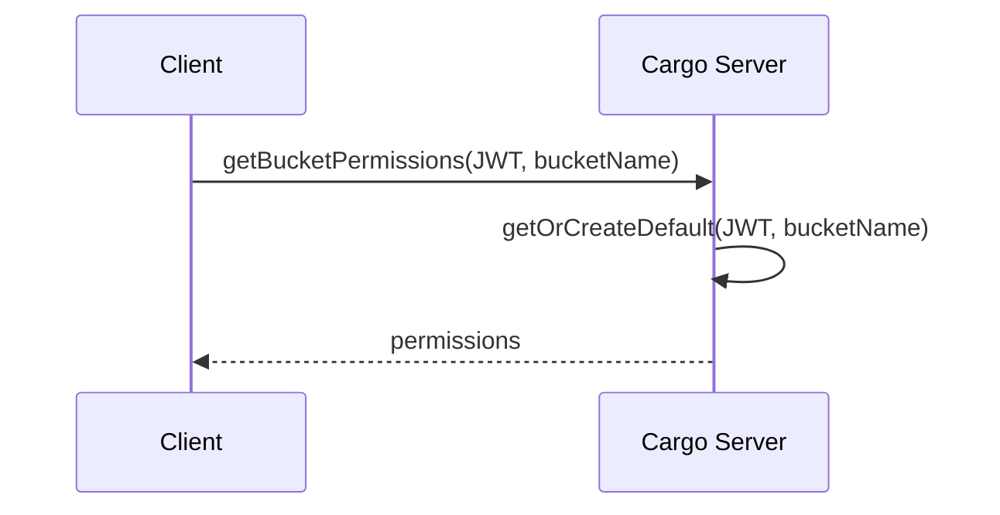
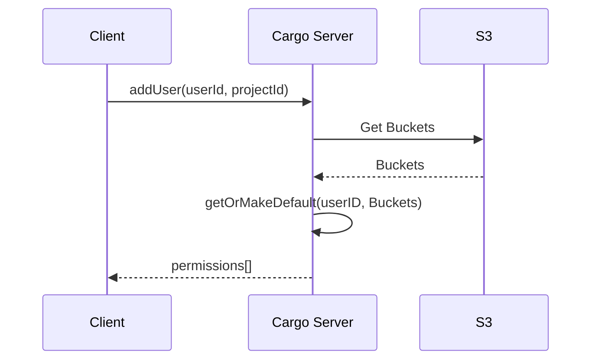
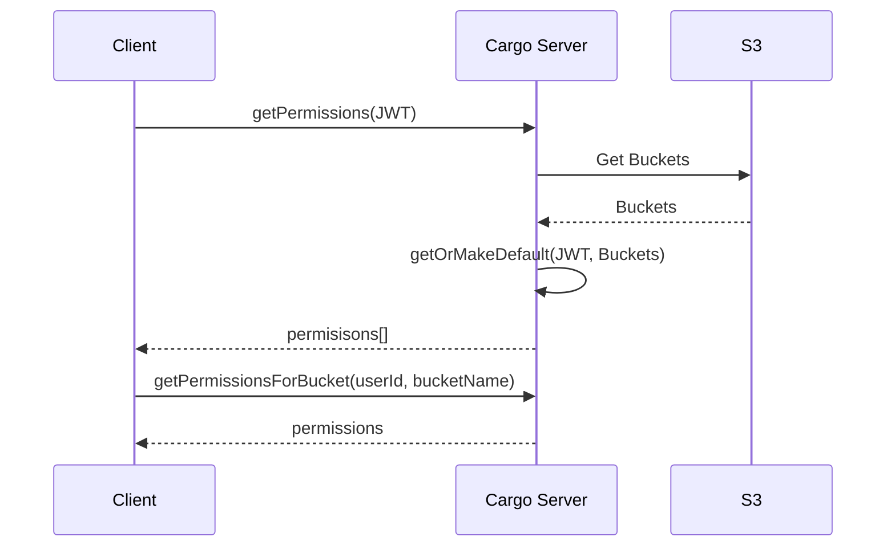
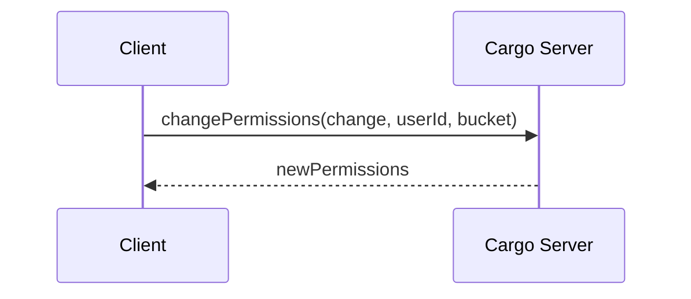

# Cargo Server

## Running the Project

### Configuration

For configurable settings, please see `src/config/configuration.ts` for the supported settings and their corresponding environment variable.

### Running in Development

1. Start an instance of MongoDB
2. Run the command `npm run start:dev`

## Example Procedures

The Cargo server supported interactions via GraphQL. Below are example workflows shown for a high level. For specifics on how to perform the actions show, refer to the GraphQL documentation. In the diagrams below, "Client" refers to the software interacting with the Cargo Server. This should typically be either the Cargo Middleware or Cargo Client.

:warning: Developer note, the function names shown in the diagrams are to illustrate the operations taking place. They are not the actual function names

### Adding a Bucket to the Server

Buckets do not have to be manually added to the Cargo Server. Instead when permissions are retrieved, the Cargo server will first check for what buckets exist then populate permissions for those buckets.

:warning: In the future this process will be optimized to automatically populate permissions based on changes made against the S3 backend instance.

### Adding a User to the Server

Adding a user will automatically populate user permissions for all buckets in the user's corresponding project. The user will be granted no actual access so the correct permissions will need to be added later. 

The client will get back the list of permissions that were generated for the user.

:warning: Once better integration is made with the Auth microservice, this should update more automatically and not require a manual call

### Getting Permissions

The client can request permissions in a couple of different contexts. The client can either get the permissions for a single user on a single bucket, or they can get all user permissions for a given user.

### Updating Permissions

The client can update the permissions by providing the permissions for a user and bucket.

